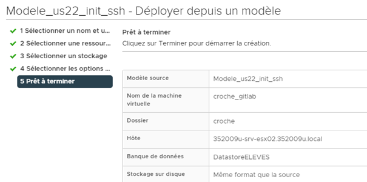
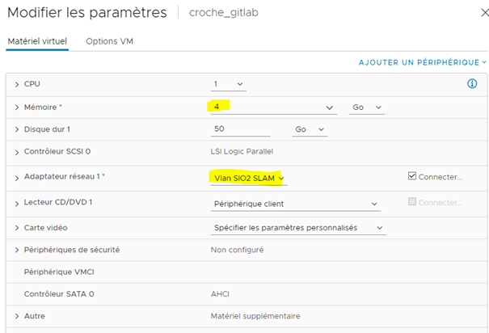
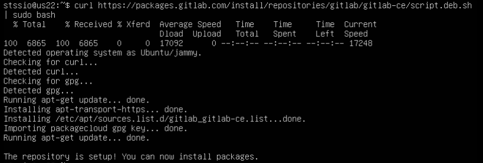
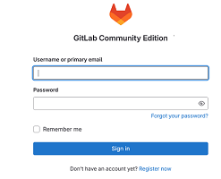

# VM serveur Gitlab
**Objectif** : Mettre en place un serveur de recette Gitlab pour tester l'application web Gitlab-Admin dédiée aux administrateurs d'un serveur gitlab.

**Ressources** : 

- la fiche technique de création d'une VM sous VMWare à partir d'un modèle, [ici](),
- sous VMWare, le modèle de VM us22_init_ssh hébergeant Ubuntu Server 22.04 avec le service ssh activé

## Présentation de la suite VSphere de VMWare
La suite VSphere de l'éditeur VMWare y est installée. Elle comprend :

- l'hyperviseur ESXi, hyperviseur de type 1 ou dit natif, installé sur chacun des serveurs physiques regroupés dans la ferme. 
- vCenter Server qui est un outil de gestion de plusieurs hyperviseurs et des éléments liés. Ces objets (machines virtuelles, hyperviseurs, répertoires, etc.) sont des objets de l’inventaire vCenter. vCenter Server constitue le point central de création, de lancement et d'arrêt des machines virtuelles.
- vSphere Client qui correspond actuellement à une interface web client permettant d'accéder à l'outil de gestion vCenter Server
 
## Création de la VM Gitlab sous VMWare
Le serveur Gitlab correspondra à une machine virtuelle hébergée sur la suite VSphere.

Procédure à suivre, détail dans la fiche technique sous OneDrive :

- Demander à accéder au vcenter en saisissant l'URL [https://352009u-srv-vct.352009u.local](https://352009u-srv-vct.352009u.local)
- Se connecter sous vcenter en renseignant votre login et mot de passe du domaine local
- Ouvrir l'inventaire et se déplacer dans `CD1 / VM-ELEVES / Modeles`
- Créer une VM ayant pour nom `VotreNom_Gitlab18` à partir du modèle `Modele_us24_init_ssh`
- Choisir l’emplacement `VM_ELEVES/SIO2_2526/SLAM` pour le stockage de la nouvelle VM
- Vérifier que les caractéristiques de la VM soient bien celles-ci : 
  

- Demander ensuite à modifier les paramètres de la VM pour sélectionner 4GO pour la RAM et `VLAN_SIO2_SLAM` pour l'adaptateur réseau. En final, les paramètres doivent être ceux-ci : 
  

- Démarrer la VM et se connecter sous le nom stssio / stssio.

## Configuration de la VM Gitlab
### Passer en mode d'adressage IP statique
L'objectif est de pouvoir atteindre le serveur Gitlab des postes du réseau SIO et vice-versa. 

Le mode d'accès réseau sous VMWare équivalent au mode pont sous Vbox correspond à l’adaptateur réseau `VLAN_SIO2_SLAM`. 

Les VMS Linux sous VMWare affectent le nom `ens160` et non `enp0s3` à la carte réseau. 

Passer la configuration réseau IP de votre serveur Gitlab en mode statique sur l'adresse IP 100.115.29.x / 23, x étant le numéro de la 1ère adresse IP du groupe de 5 adresses IP qui vous a été attribué. Les groupes sont notés dans le fichier `IPfixe_2025_SIO.xls` sous Triskell.

Vérifier la communication réseau IP entre la machine hôte et le serveur Gitlab et ceci dans les 2 sens. 

L'installation de gitlab et la restauration d'un fichier backup pourront être poursuivies en ouvrant une session ssh sous l'outil `Mobaxterm`. Cet outil gère mieux les copier / coller et permet d'enregistrer tout l'historique des commandes passées et résultats obtenus.

### Installer gitlab community edition
Demander à mettre à jour les paquets.
Demander à voir la version courante du paquet gitlab-ce.
Le paquet gitlab-ce ne doit pas être trouvé, il faut ajouter le dépôt spécifique de gitlab pour que apt aille récupérer la liste des paquets proposés par ce dépôt.
Ajouter le dépôt gitlab par la commande suivante :
```bash
curl https://packages.gitlab.com/install/repositories/gitlab/gitlab-ce/script.deb.sh | sudo bash
```
Vous devriez voir l'affichage suivant :


Demander à voir la liste des versions du package `gitlab-ce` :
```bash
apt list --all-versions gitlab-ce
```

Demander à installer la version 18.4.1 :
```bash
apt install gitlab-ce=18.4.1-ce.0
```

Valider le redémarrage des services en laissant la sélection des services par défaut.
### Vérifier les services gitlab
- Changer l'URL externe d'accès à Gitlab dans le fichier de configuration `/etc/gitlab/gitlab.rb`, x correspondant à votre adresse IP :
```bash
external_url 'http://100.115.29.x 
```

- Appliquer ce changement par la commande suivante :
```bash
 sudo gitlab-ctl reconfigure 
```

- Vérifier que les services associés à gitlab s'exécutent correctement par la commande suivante :
```bash
gitlab-ctl status
```

Côté poste client, vérifiez que la saisie de l'URL pour accéder à votre serveur gitlab vous affiche bien le formulaire de connexion.


### Restaurer un jeu d'essai
Vous disposez d'un jeu d'essai comprenant :

- 10 utilisateurs non administrateur
- 3 groupes
- 2 à 3 projets par utilisateur, 1 projet par groupe

Ce jeu d'essai se matérialise par un fichier de sauvegarde .tar : [ap31_2025_18.4.1_gitlab_backup.tar](../data) et un fichier [gitlab-secrets.json](../data/gitlab-secrets.json).

Cette sauvegarde a été réalisée sur un serveur gitlab de même version que celle de votre VM serveur, condition nécessaire pour que la restauration puisse être faite.
Voici la procédure à suivre pour la restauration de ce jeu d'essai : 

1. Via winscp, copier le fichier de sauvegarde `.tar` et le fichier `.json` sous le dossier `/home/stssio`
2. Via la console serveur, copier le fichier de sauvegarde .tar sous `/var/opt/gitlab/backups`, répertoire où gitlab stocke ses fichiers de sauvegarde.
4. Faire en sorte que le fichier de sauvegarde appartienne bien au compte Linux `git:git`
```bash
sudo chown git:git /var/opt/gitlab/backups/ap31_2025_18.4.1_gitlab_backup.tar
```
3. Via la console serveur, copier le fichier `gitlab-secrets.json` sous `/etc/gitlab`, répertoire où gitlab stocke ses fichiers de configuration.
5. Vérifier que le fichier `/etc/gitlab/gitlab-secrets.json` appartienne bien au compte `root:root` avec seulement les droits d'accès en lecture / écriture pour le compte root uniquement.
6. Arrêter les processus puma et gitlab de gitlab qui sont connectés au serveur de base de données.
```bash
sudo gitlab-ctl stop puma
sudo gitlab-ctl stop sidekiq
```
puis vérifier que les services sont bien à l'arrêt :
```bash
sudo gitlab-ctl status
```
7. Demander à restaurer la base de données en spécifiant le fichier visé sans le suffixe `_gitlab_backup.tar` :
```bash
sudo gitlab-backup restore BACKUP=ap31_2025_18.4.1
```
8. puis demander à reconfigurer, relancer et vérifier gitlab par les commandes suivantes :
```bash
sudo gitlab-ctl reconfigure
sudo gitlab-ctl restart
sudo gitlab-ctl status
sudo gitlab-rake gitlab:check SANITIZE=true
sudo gitlab-rake gitlab:check:repos
```
9. Via l'application web gitlab, vérifiez alors le nouveau contenu de la base gitlab en termes d'utilisateurs, de projets et de groupes. 

## Opérations de maintenance
### Créer un nouveau backup
```bash
sudo gitlab-backup create
```

### Voir les logs
```bash
# Logs Gitlab
??? logs -f gitlab

# Logs GitLab spécifiques
sudo tail -f /var/log/gitlab/gitlab-rails/production.log
```

### Accéder à la console Rails
```bash
sudo gitlab-rails console
```

## 10. Troubleshooting

### Si la restauration échoue
1. Vérifiez les permissions des fichiers
2. Assurez-vous que la version de GitLab correspond
3. Vérifiez l'espace disque disponible
4. Consultez les logs : `sudo tail -f /var/log/gitlab/gitlab-rails/production.log`

### Problèmes courants
- **Erreur de permissions** : Réappliquez les permissions avec `chown 998:998`
- **Version incompatible** : Utilisez la même version de GitLab que celle du backup
- **Manque d'espace** : Vérifiez l'espace disque avec `df -h`

### Récupération du mot de passe root initial
```bash
# Si c'est une nouvelle installation
sudo grep 'Password:' /etc/gitlab/initial_root_password
```

## Notes importantes

- Toujours faire un backup avant une restauration
- La restauration peut prendre du temps selon la taille des données
- Vérifiez la compatibilité des versions entre le backup et l'installation GitLab
- Le fichier gitlab-secrets.json doit être restauré AVANT la reconfiguration
- Testez l'accès web et SSH après la restauration